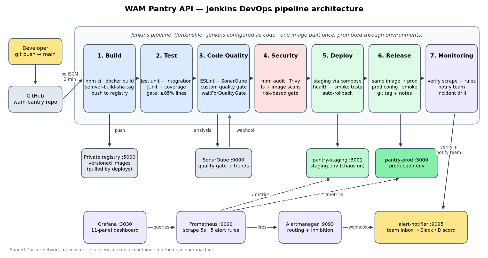

# WAM Pantry API — Jenkins DevOps Pipeline

A food-relief pantry API for **With A Mission** (Deakin student food relief), delivered through a
seven-stage Jenkins pipeline: **Build → Test → Code Quality → Security → Deploy → Release → Monitoring**.



## The application

Node.js 22 + Express 5 REST API with an in-memory repository layer.

| Area | Endpoints |
|---|---|
| Auth (JWT, bcrypt) | `POST /api/auth/register`, `POST /api/auth/login` |
| Inventory (admin CRUD, public browse) | `GET/POST /api/items`, `GET/PATCH/DELETE /api/items/:id`, `GET /api/items/low-stock`, `GET /api/items/expiring?days=7` |
| Pickup bookings | `POST /api/bookings`, `GET /api/bookings/mine`, `DELETE /api/bookings/:id`, `GET /api/bookings` (admin), `POST /api/bookings/:id/collect` (admin) |
| Operations | `GET /health`, `GET /ready`, `GET /metrics` (Prometheus), `GET /api/version`, `GET /api/admin/stats` |
| Staging only | `GET /api/chaos/error`, `GET /api/chaos/slow` (incident simulation; disabled in production) |

Business rules: booking reserves stock atomically (no partial reservations), overbooking returns `409`,
one booking per student per pickup day, bookings max 14 days ahead and 10 items, cancelling returns stock.
Security controls: helmet headers, rate limiting, input validation, constant-time login responses,
no stack traces to clients, fail-fast on weak secrets in staging/production, non-root read-only container.

```bash
npm ci
npm start                 # http://localhost:3000 (dev admin: admin@wam.local / admin-dev-password)
npm test                  # unit + integration
npm run test:ci           # with coverage gate + JUnit report
npm run lint
```

## Running the pipeline (local lab)

**Prerequisites:** Docker Desktop (or Docker Engine + Compose v2), Git, and bash (macOS/Linux terminal,
or Git Bash/WSL on Windows). About 6 GB RAM free for Docker.

```bash
# 1. Clone
git clone https://github.com/YOUR-USERNAME/wam-pantry.git && cd wam-pantry

# 2. Configure (set REPO_URL to your GitHub repo, choose passwords)
cp infra/.env.example infra/.env
nano infra/.env

# 3. One-command setup: network, SonarQube (password, project, quality gate,
#    webhook, token), private registry, Jenkins (plugins, credentials, job)
./infra/bootstrap.sh
```

Then open **http://localhost:8080**, log in as `admin`, open the **wam-pantry** job and click
**Build with Parameters**. (The first run registers the parameters; afterwards Jenkins polls GitHub every
2 minutes and builds automatically on every push to `main`.)

| Service | URL |
|---|---|
| Jenkins | http://localhost:8080 |
| SonarQube | http://localhost:9000 |
| Staging / Production API | http://localhost:3001 / http://localhost:3000 |
| Grafana dashboard | http://localhost:3030 (anonymous view; admin / `GRAFANA_ADMIN_PASSWORD`) |
| Prometheus (targets, alerts) | http://localhost:9090/targets, http://localhost:9090/alerts |
| Alertmanager | http://localhost:9093 |
| Team alert inbox | http://localhost:9095 |
| Private registry catalog | http://localhost:5000/v2/_catalog |

Stop everything with `./infra/teardown.sh` (add `--volumes` to wipe data).

### Pipeline parameters

| Parameter | Default | Purpose |
|---|---|---|
| `DEPLOY_TO_PRODUCTION` | `true` | Promote to production automatically after staging passes |
| `INCIDENT_DRILL` | `none` | `app-down` stops production; `error-rate` floods staging with 500s. Measures time-to-detect and time-to-resolve |
| `PUSH_GIT_TAG` | `false` | Push the `v<version>` release tag to GitHub (needs `GITHUB_TOKEN` in `infra/.env`) |

## Stage summary

| # | Stage | Tools | Gate (fails the build when…) |
|---|---|---|---|
| 1 | Build | npm, Docker (multi-stage), private registry, Jenkins artifacts | build or push fails |
| 2 | Test | Jest, Supertest, jest-junit, Jenkins Coverage plugin | any test fails, or coverage < 85% statements/lines/functions, 75% branches |
| 3 | Code Quality | ESLint, SonarQube (custom "WAM Pantry Gate") | ESLint errors, or the quality gate fails (coverage < 80%, duplication > 3%, maintainability/reliability/security rating worse than A) |
| 4 | Security | npm audit, Trivy fs (deps, secrets, IaC), Trivy image, `scripts/security-summary.js` | fixable HIGH/CRITICAL in shipped deps or image, any secret, HIGH/CRITICAL misconfig in the app Dockerfile |
| 5 | Deploy (staging) | Docker Compose, health checks, Jest smoke tests | unhealthy or smoke tests fail → automatic rollback |
| 6 | Release (production) | Same image promoted, `production.env`, git tag, release notes | unhealthy or smoke tests fail → automatic rollback |
| 7 | Monitoring | Prometheus, Alertmanager, Grafana, alert-notifier | target not scraped, rules missing, or a critical alert already firing |

Details: [`docs/SECURITY.md`](docs/SECURITY.md).

## Repository layout

```
src/                 application (app.js wires everything; services hold business logic)
tests/unit|integration|smoke
Jenkinsfile          the pipeline
Dockerfile           multi-stage, non-root runtime image
deploy/              docker-compose.yml + env/staging.env, env/production.env
scripts/             deploy/rollback, security gate, monitoring check, incident drill, notify, release notes
monitoring/          Prometheus (+ alert rules), Alertmanager, Grafana (+ dashboard), alert-notifier
infra/               Jenkins image + Configuration as Code, SonarQube, registry, bootstrap/teardown
```

## Troubleshooting

- **SonarQube exits on Linux** with a `vm.max_map_count` error: `sudo sysctl -w vm.max_map_count=262144`.
- **`permission denied` on `/var/run/docker.sock`**: the Jenkins container must run as root in this lab (already set in `infra/docker-compose.yml`).
- **Quality gate step waits until timeout**: the SonarQube webhook must point to `http://jenkins:8080/sonarqube-webhook/` (bootstrap creates it; check under SonarQube → Administration → Webhooks).
- **Port already in use**: something else is on 3000/3001/8080/9000; stop it or change the published port.
- **Apple Silicon**: all images used are multi-arch; first builds are slower.
